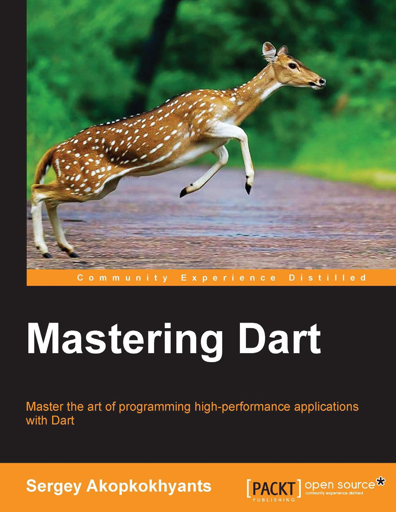

# 《Mastering Dart》 精通Dart 
### Master the art of programming high-performance applications with Dart 
### 编写高性能Dart应用程序的艺术

# 书籍简介
* 作者: Sergey Akopkokhyants
* ISBN: 978-1-78398-956-0
* 页数：326

# 译者的话
本翻译项目的 GITHUB 开源地址：https://github.com/springsu/Mastering-Dart.git

如果你在阅读本书的过程中有发现不明白或者错误的地方，请随时到项目地址发布 issue 或者 fork 项目后发布 pr 帮助译者改善！不胜感激！

# 开源协议
本项目基于 MIT 协议开源。

# 联系方式
springsu@vip.qq.com