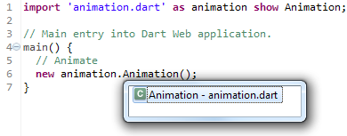
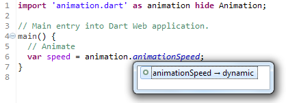
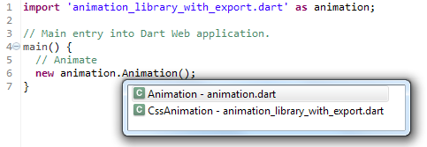

<!-- 原书第7页 -->

# 第一章 Dart基础进阶

Dart是一种非常年轻的计算机语言，具有许多有趣的特性。它是一种基于类的、面向对象的语言，具有可选的类型，它可以帮助您编写非常强大的程序。在本章中，我们将涵盖以下主题:

+ 模块化和命名空间
+ 不同作用域下的函数和闭包
+ 类和混入
+ 方法和操作

## 1.1 模块化和命名空间
复杂的事物是世界的基础。要理解我们周围事物的复杂性，就必须理解它们是由哪些部分组成的。功能和行为的模块化推动了复杂事物的演变。具有明确边界和功能的独立小组件构成了功能的模块化，能够独立发展的特征和属性构成了行为的模块化。

模块化并不是什么新东西。早些时候，产品制造商想方设法增加产量，提升产品质量，同时设法降低成本压力。通过模块化，他们实现了这一点。模块化设计可以在汽车工业、建筑和许多其他行业中看到。亨利·福特(Henry Ford)通过在他的装配线上使用标准化和可互换的零部件，引入了模块化的概念。因此，他降低了生产周期和成本，实现了汽车的大规模生产。今天许多公司仍然在使用这些概念。

<!-- 原书第8页 -->

### 1.1.1 软件开发中的模块化
分解就是把复杂事物表示成部分的集合。类似的，现实世界中的复杂软件也可以分解成功能性部分，这些功能性部分称为模块。每一个模块可以单独地创建、修改、测试、使用和替换。

让我们看看模块化的好处。为简化起见，我们把模块分中开发与后期制做两个阶段，每个阶段都有自己的特定任务需要在该阶段的范围内解决。

开发阶段有以下好处:
+ 每个模块需要更少的代码。
+ 新功能或变更可以单独引入到模块中，也可以从其他模块中分离。
+ 在一个模块中，可以很容易地识别和修复错误。
+ 模块可以独立构建和测试。
+ 编写模块的程序员可以在同一个应用程序上协作。
+ 相同的模块可以在许多应用程序中复用。
+ 应用程序有一个主模块和许多辅助模块。每个模块封装一个特定的功能，并且通过主模块提供的松耦合通信通道来进行集成。

后期制做阶段的好处有：
+ 在版本控制中的模块可以很容易地维护和测试。
+ 模块中问题修复与非基础结构变更可以在不影响其它模块的情况下完成。

模块化的明显缺点是管理多个模块带来的复杂度增加，尤其是当每个模块都单独进行版本控制、更新并依赖于其他模块时。

### 1.1.2 Dart的模块化
Dart是以模块为基础设计的，包，库与类实现了Dart的模块化。

<!-- 原书第9页 -->

一个库把功能暴露为一组接口，隐藏了其余部分的具体实现。在概念上，它非常类似于面向对象编程(OOP)中对象之间的关注点分离。将应用程序分解成多个库，有助于最小化耦合并使代码更容易维护。一个简单的函数、一个单独类、多个类或者一个库的所有API组成的集合，这些方式都可以实现一个库。Dart应用程序也是一个库。

一个包就是一个包括了pubspec.yaml文件的简单目录，里边可以包含若干库与资源。pubspec.yaml文件包含了库的重要信息，如作者、依赖的其它库。下边是一个简单的pubspec.yaml文件：

```
name: animation_library
version: 0.1.0
author: Sergey Akopkokhyants
description: Animation library for Web application
dependencies:
  browser: any
```
真实的pubspeck.yaml有较多字段，具体可以查看：https://www.
dartlang.org/tools/pub/pubspec.html ，在包能被使用之前，包需要发布到包管理系统上，https://pub.dartlang.org/ 就是一个名为pub的线上包管理系统。为了发布与获取包，我们使用了一个同名的pub工具应用。这个pub工具从pubspec.yaml文件中得到依赖的包信息，并且从以下地址去获取所有需要的包：

+ 在https://pub.dartlang.org/ 最新更新包
+ Git仓库
+ 本地文件系统目录

Dart编辑器为自动为你管理依赖，可以直接在Dart编辑器中发布你的包。

### 1.1.3 库
命名空间是一个库所有成员的容器，库名称定义了一个命名空间。隐式命名的库会有一个空的命名空间，这会导致在尝试导入这些库（指隐式命名的库）时，会因命名空间相同而发生冲突。通过使用前缀子句(as)和一个名称前缀，可以很容易地避免导入库命名空间的冲突。

<!-- 原书第10页 -->

下边是一个隐式的命名库，所有dart:html中的资源，都可以在我们库的范围内，以前缀dom来使用。

```
/**
* 隐式命名库。
* dart:core库会自动导入。
*/
import 'dart:html' as dom;
/**
* Get [Element] by [id].
*/
dom.Element getById(String id) => dom.querySelector('#$id');
```
库的命名空间只在Dart环境中有意义。

> 注意：在JavaScript下编译的代码，会丢失所有的库信息。

Dart通过隐私实现了封装。库的每个成员或标示符都有两种权限级别之一：私有或公共。私有成员仅在声明它的库内部可见，而公共成员在任何地方可见。两者的不同体现在下划线前缀(_)，如下边代码所示：
```
// Animation library.
library animation;
// 公共类，在库内外都可见
class Animation {
// ...
}
//私有类，仅库内可见
class _AnimationLibrary {
// ...
}
// 公共变量，在库内外都可见
var animationSpeed;
```
上边的代码中，Animation库有两个类和一个变量，类Animation与变量animationSpeed是公共的，在库内外都可见。类_AnimationLibrary是私有的，仅在库内可以。

<!-- 原书第11页 -->

可以使用import语句的扩展语句show与hide来管理公共权限。下边代码使用扩展语句show指定一个具体的类名，该类可以在导入它的库中使用。

```
import 'animation.dart' as animation show Animation;
// Main entry into Dart Web application.
main() {
// Animate
new animation.Animation();
}
```

上边代码，在import语句中，animation前缀定义了导入animation.dart库的命名空间，通过这个前缀，animation.dart库中的所有公共成员可以在全局命名空间中使用。如下图所示，我们通过animation前缀可以使用Animation类：

<center> 



</center> 

下边代码使用扩展语句hide指定一个具体的类名，该类将不能在导入它的库中使用。但库中的其它公共成员是可以使用的，如下边代码所示：

```
import 'animation.dart' as animation hide Animation;
// Main entry into Dart Web application.
main() {
// Animate
var speed = animation.animationSpeed;
}
```

<!-- 原书第12页 -->

现在，我们隐藏了Animation类，但在animation命名空间下的所有其它公共成员是可以使用的，如下图所示：

<center> 



</center> 

如你所见，导入库的成员Animation类，变得不可见了，这是因为库是从公共的命名空间导出成员。如果export语句可以像import语句一样使用show和hide，那就可以使用export语句重新导出要导入的库，如下面的代码所示:

```
library animation.css;
import 'animation.dart' as animation;
export 'animation.dart' show Animation;
class CssAnimation extends animation.Animation {
// ...
}
```
上边的代码是animation.css库，我们导出了Animation类做为这个库命名空间的一部分，让我们看一下，如何使用：

<center> 



</center> 

在我们的main代码中，导出的Animation类与库原始的CssAnimation类是可用的，如果没有export语句，Animation类将在main代码中不可用。

<!-- 原书第13页 -->

## 1.2 不同作用域下的函数和闭包

### 1.2.1 使用变量命名函数

### 1.2.2 函数作为另一个函数的参数

### 1.2.3 函数作另一个函数的返回值

### 1.2.4 在数据结构中保存函数

### 1.2.4 闭包

## 1.3 类和混入

### 1.3.1 类型

### 1.3.2 类

### 1.3.3 继承

### 1.3.4 接口

### 1.3.5 混入

### 1.3.6 好的类设计

### 1.3.7 是否私有

### 1.3.8 变量与访问方法

### 1.3.9 继承与结合

## 1.4 类方法和操作

### 1.4.1 使用前的参数校验

### 1.4.1 好的类方法设计

## 1.5 总结